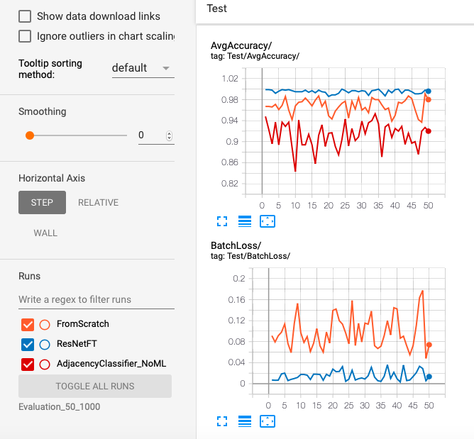

# Evaluation and comparisons of models

We have three models to solve the __left-right-adjacency-problem__

* AdjacencyClassifier_NoML 
* FromScratch
* ResNetFT

We evaulate these models on a test data set and compare their respective performances


```python
from PIL import Image
import matplotlib.pyplot as plt
import matplotlib.ticker as plticker
import os

import pprint
import itertools
from collections import defaultdict
#from collections import OrderedDict

# generate random integer values
from random import seed
from random import randint
import numpy as np
#from pylab import array
from random import sample
import math

import torch
from torch.utils.data import Dataset, DataLoader, IterableDataset
from torchvision import transforms, utils, models
from torch import nn, optim
from torchvision import datasets, transforms
#from torchvision.utils import make_grid


#import csv
from time import time

from Checking_adjacency_dataset import *
from FromScratch_CNN import *
from ResNetFT_Finetuning import *
from Training_template import *
from Adjacency_distance import *

from torch.utils.tensorboard import SummaryWriter
import sys

```

# Setting up

## Creating datasets and dataloaders


```python
#Dataset global variables
my_test_dir = os.getenv("MY_TEST_DIR")
```


```python
#Change this to False if you want to set the variables instead of using default
default_setting_for_dataset = False
```


```python
data_inputs = set_dataset_input(default_setting_for_dataset)
my_sq_puzzle_piece_dim = data_inputs[0] 
my_size_of_buffer = data_inputs[1]
my_model_dim = data_inputs[2]
my_batch_size = data_inputs[3]
```

    Enter sq_puzzle_piece_dim 100
    Enter size_of_shuffle_buffer 1000
    Enter model_dim 224
    Enter batch_size 1000


```python
print(f"my_sq_puzzle_piece_dim = {my_sq_puzzle_piece_dim}")
print(f"my_size_of_buffer = {my_size_of_buffer}")
print(f"my_model_dim = {my_model_dim}")
print(f"my_batch_size = {my_batch_size}")
```

    my_sq_puzzle_piece_dim = 100
    my_size_of_buffer = 1000
    my_model_dim = 224
    my_batch_size = 1000


```python
test_adjacency_dataset = AdjacencyDataset(my_test_dir, my_sq_puzzle_piece_dim, 
                                        my_size_of_buffer, my_model_dim)
test_adjacency_dataloader = DataLoader(test_adjacency_dataset, my_batch_size)
```

## Fixing hyperparameters 


```python
#Hyperparameters

#Change this to False if you want to set the hyperparameters instead of using default
default_setting_for_hyperparameters = True
```


```python
my_learning_rate,my_momentum = get_hyperparameters(default_setting_for_hyperparameters)
```


```python
my_threshold= 3.3036
```


```python
print(f"my_learning_rate = {my_learning_rate}")
print(f"my_momentum = {my_momentum}")
print(f"my_threshold = {my_momentum}")
```

    my_learning_rate = 0.001
    my_momentum = 0.9
    my_threshold = 0.9


## Checking GPU availability


```python
if torch.cuda.is_available():
    GpuAvailable=True
    my_device = torch.device("cuda:0")   
    print("Running on the GPU")
else:
    GpuAvailable=False
    my_device = torch.device("cpu")
    print("Running on the CPU")


```

    Running on the CPU


# Creating and displaying tensorboard writer


```python
tensorboard_dir="Evaluation_50_1000"
```


```python
%load_ext tensorboard
%tensorboard --logdir="$tensorboard_dir"

```

    The tensorboard extension is already loaded. To reload it, use:
      %reload_ext tensorboard


<iframe id="tensorboard-frame-743b4e491b59ad08" width="100%" height="800" frameborder="0">
</iframe>
<script>
  (function() {
    const frame = document.getElementById("tensorboard-frame-743b4e491b59ad08");
    const url = new URL("/", window.location);
    url.port = 6009;
    frame.src = url;
  })();
</script>


# Evaluating the models


```python


updated_model_names = ["FromScratch", "ResNetFT", "AdjacencyClassifier_NoML"]

model_details = {}
for i in range(2):
    model_name=updated_model_names[i]
    sub_dir = os.path.join(tensorboard_dir,model_name)
    model_details[model_name]= {}
    model_details[model_name]['writer']=SummaryWriter(sub_dir) 
    model_details[model_name]['no_ML']=False
    model_details[model_name]['GpuAvailable']=GpuAvailable
    model_details[model_name]['device']=my_device
    model,loss_criterion,optimizer = make_model_lc_optimizer(model_name,
                                                                my_learning_rate,
                                                                my_momentum)
    best_model_path=f"./best_model_for_{model_name}.pt"
    model, optimizer, epochs_trained, min_val_loss = load_checkpoint_gpu(best_model_path,
                                                                         model, 
                                                                         optimizer,
                                                                         model_details[model_name]['GpuAvailable'])                                                           
    model_details[model_name]['model']=model
    model_details[model_name]['loss_criterion']=loss_criterion
    model_details[model_name]['optimizer']=optimizer
    if model_details[model_name]['GpuAvailable']:
        model_details[model_name]['model'].to(my_device)
    model_details[model_name]['test_batch_losses'] = [] 
    model_details[model_name]['test_batch_accuracies'] = [] 
    
for i in range(2,3):
    model_name=updated_model_names[i]
    sub_dir = os.path.join(tensorboard_dir,model_name)
    model_details[model_name]= {}
    model_details[model_name]['writer']=SummaryWriter(sub_dir) 
    model_details[model_name]['no_ML']=True
    model_details[model_name]['GpuAvailable']=False
    model_details[model_name]['device']=torch.device("cpu")
    model_details[model_name]['model']=AdjacencyClassifier_NoML()
    model_details[model_name]['loss_criterion']=None
    model_details[model_name]['optimizer']=None
    model_details[model_name]['test_batch_losses'] = [] 
    model_details[model_name]['test_batch_accuracies'] = [] 
```


```python
def evaluate_step(model_name, test_batch_data, test_batch_labels):
    my_board_writer = model_details[model_name]['writer']
    model=model_details[model_name]['model']    
    device=model_details[model_name]['device']
    test_batch_data, test_batch_labels = test_batch_data.to(device), test_batch_labels.to(device)
    if model_details[model_name]['no_ML']:
        #Get predictions
        test_predictions = model.predictions(test_batch_data, my_threshold)   
    else:
        test_batch_outputs = model(test_batch_data)
        #Compute and plot loss for this batch
        test_batch_loss = loss_criterion(test_batch_outputs, test_batch_labels)
        test_loss_in_this_batch = test_batch_loss.item()
        model_details[model_name]['test_batch_losses'].append(test_loss_in_this_batch)
        my_board_writer.add_scalar(f'Test/BatchLoss/', test_loss_in_this_batch, no_of_batches)
        #Get predictions
        test_score, test_predictions = torch.max(test_batch_outputs, axis = 1) 
    #Compute and plot accuracy for this batch    
    test_correct_in_this_batch = torch.sum(test_predictions == test_batch_labels.data).item()
    test_avg_accuracy_in_this_batch = test_correct_in_this_batch/my_batch_size
    model_details[model_name]['test_batch_accuracies'].append(test_avg_accuracy_in_this_batch)
    my_board_writer.add_scalar(f'Test/AvgAccuracy/', test_avg_accuracy_in_this_batch, no_of_batches)
                
```


```python
max_batches = 50
no_of_batches = 0
with torch.no_grad():
        for test_batch_data, test_batch_labels in test_adjacency_dataloader:
                no_of_batches+= 1
                for model_name in updated_model_names:
                    evaluate_step(model_name, test_batch_data, test_batch_labels)
                
                if no_of_batches == max_batches:
                    break
            


```


```python
for model_name in updated_model_names:
    model_details[model_name]['writer'].close()

```

_The evaluation was run on Google Colabs so as to use GPU services_

# Results

The following is a snapshot of the evaluation tensorboard after testing each model on 50 batches with batch-size 1000



We see that ResNetFT's performance is very high with more than 99.8% accuracy consistently, while FromScratch performs with an accuracy varying between 94-99%. The AdjacencyClassifier_NoML underperforms in comparison varying between 84-95% accuracy


```python

```
