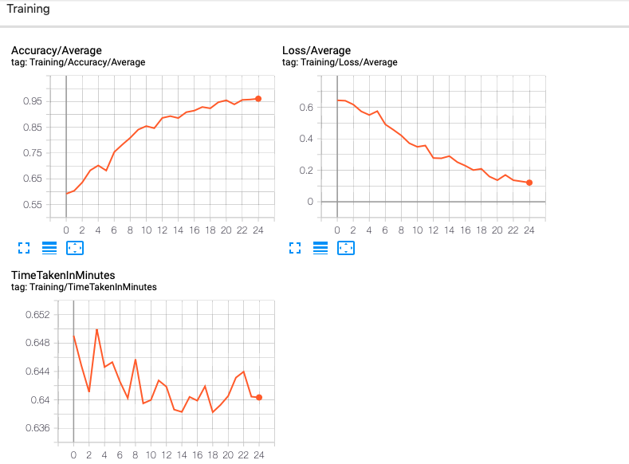
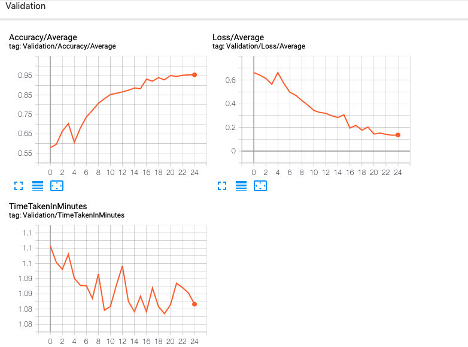

# Training FromScratch


We train our FromScratch CNN model to solve the checking_left_right_adjacency problem


```python
from PIL import Image
import matplotlib.pyplot as plt
import matplotlib.ticker as plticker
import os

import pprint
import itertools
from collections import defaultdict
#from collections import OrderedDict

# generate random integer values
from random import seed
from random import randint
import numpy as np
#from pylab import array
from random import sample
import math

import torch
from torch.utils.data import Dataset, DataLoader, IterableDataset
from torchvision import transforms, utils, models
from torch import nn, optim
from torchvision import datasets, transforms
#from torchvision.utils import make_grid


#import csv
from time import time

from Checking_adjacency_dataset import *
from FromScratch_CNN import *
from ResNetFT_Finetuning import *
from Training_template import *

from torch.utils.tensorboard import SummaryWriter
import sys

```

# Setting up

## Creating datasets and dataloaders


```python
#Dataset global variables
my_root_dir = os.getenv("MY_ROOT_DIR")
my_val_dir = os.getenv("MY_VAL_DIR")
```


```python
#Change this to False if you want to set the variables instead of using default
default_setting_for_dataset = True
```


```python
data_inputs = set_dataset_input(default_setting_for_dataset)
my_sq_puzzle_piece_dim = data_inputs[0] 
my_size_of_buffer = data_inputs[1]
my_model_dim = data_inputs[2]
my_batch_size = data_inputs[3]
```


```python
print(f"my_sq_puzzle_piece_dim = {my_sq_puzzle_piece_dim}")
print(f"my_size_of_buffer = {my_size_of_buffer}")
print(f"my_model_dim = {my_model_dim}")
print(f"my_batch_size = {my_batch_size}")
```

    my_sq_puzzle_piece_dim = 100
    my_size_of_buffer = 1000
    my_model_dim = 224
    my_batch_size = 20


```python
my_dataloaders = create_dataloaders(my_root_dir,my_val_dir, my_sq_puzzle_piece_dim,
                       my_size_of_buffer, my_model_dim,my_batch_size)
```

## Fixing model type, hyperparameters and epochs


```python
#Model details
my_model_name, feature_extract = get_model_details()
```

    Press 0 for FromScratch and 1 for ResNetFT 0
    ************
    Using FromScratch
    feature_extracting : False


```python
my_model_name
```


    'FromScratch'


```python
#Hyperparameters

#Change this to False if you want to set the hyperparameters instead of using default
default_setting_for_hyperparameters = True
```


```python
my_learning_rate,my_momentum = get_hyperparameters(default_setting_for_hyperparameters)
```


```python
print(f"my_learning_rate = {my_learning_rate}")
print(f"my_momentum = {my_momentum}")
```

    my_learning_rate = 0.001
    my_momentum = 0.9


```python
#Training epochs
my_epochs = 25
```

## Creating models, loss criterion and optimizers


```python
my_model, my_loss_criterion, my_optimizer = make_model_lc_optimizer(my_model_name,
                                                                    my_learning_rate, my_momentum,
                                                                    feature_extract)


```

    Using FromScratch - Expect more number of parameters to learn!
    	 bigunit.0.conv1.weight
    	 bigunit.0.conv2.weight
    	 bigunit.0.unit.2.weight
    	 bigunit.0.unit.2.bias
    	 bigunit.0.unit.5.weight
    	 bigunit.0.unit.5.bias
    	 bigunit.1.conv1.weight
    	 bigunit.1.conv2.weight
    	 bigunit.1.unit.2.weight
    	 bigunit.1.unit.2.bias
    	 bigunit.1.unit.5.weight
    	 bigunit.1.unit.5.bias
    	 bigunit.2.conv1.weight
    	 bigunit.2.conv2.weight
    	 bigunit.2.unit.2.weight
    	 bigunit.2.unit.2.bias
    	 bigunit.2.unit.5.weight
    	 bigunit.2.unit.5.bias
    	 bigunit.3.conv1.weight
    	 bigunit.3.conv2.weight
    	 bigunit.3.unit.2.weight
    	 bigunit.3.unit.2.bias
    	 bigunit.3.unit.5.weight
    	 bigunit.3.unit.5.bias
    	 bigunit.4.conv1.weight
    	 bigunit.4.conv2.weight
    	 bigunit.4.unit.2.weight
    	 bigunit.4.unit.2.bias
    	 bigunit.4.unit.5.weight
    	 bigunit.4.unit.5.bias
    	 bigunit.5.conv1.weight
    	 bigunit.5.conv2.weight
    	 bigunit.5.unit.2.weight
    	 bigunit.5.unit.2.bias
    	 bigunit.5.unit.5.weight
    	 bigunit.5.unit.5.bias
    	 fc1.weight
    	 fc1.bias
    	 bn1.weight
    	 bn1.bias
    	 fc2.weight
    	 fc2.bias
    	 bn2.weight
    	 bn2.bias
    No_of_parameters to learn : 44


## Checking GPU availability


```python
if torch.cuda.is_available():
    device = torch.device("cuda:0")   
    print("Running on the GPU")
    #putting model on gpu
    my_model.to(device)
else:
    device = torch.device("cpu")
    print("Running on the CPU")


```

    Running on the CPU


# Creating and displaying tensorboard writer


```python
tensorboard_dir=f"Training_{my_model_name}"
my_board_writer = SummaryWriter(tensorboard_dir) 
```


```python
%load_ext tensorboard
%tensorboard --logdir="$tensorboard_dir"
```


<iframe id="tensorboard-frame-70416521db354d89" width="100%" height="800" frameborder="0">
</iframe>
<script>
  (function() {
    const frame = document.getElementById("tensorboard-frame-70416521db354d89");
    const url = new URL("/", window.location);
    url.port = 6006;
    frame.src = url;
  })();
</script>


# Training the model


```python
train_it(my_epochs, 0, 
        my_model_name, my_model, my_loss_criterion, my_optimizer,
        my_batch_size, my_dataloaders,my_board_writer,device,batches_per_epoch=500)
```

_We actually ran this notebook and trained the FromScratch model on Google Colabs so as to use GPU services._

# Results

The following is a snapshot of the tensorboard after training the model for 25 epochs with 500 batches per epoch and batch-size 20





Eyeballing, we see that our model __FromScratch__ achieves around __95%__ validation accuracy after this preliminary training with validation negative log likelihood loss around __0.13__
