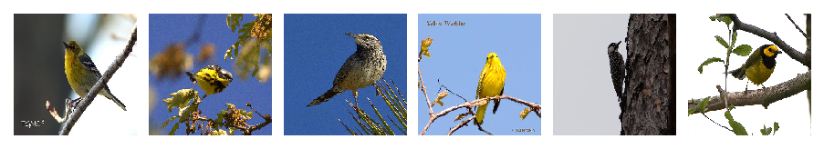
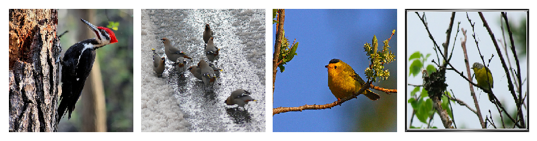
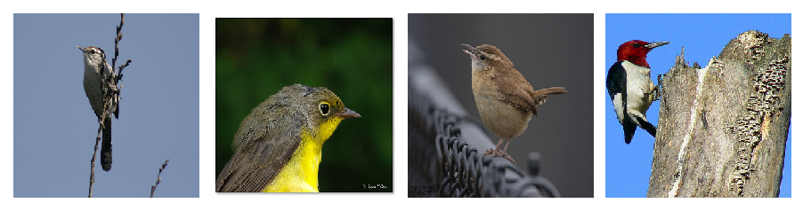
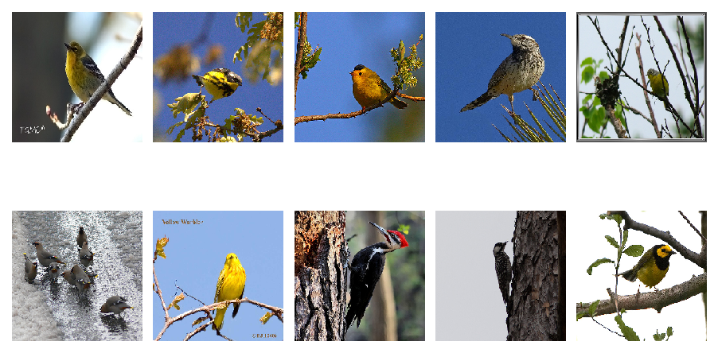
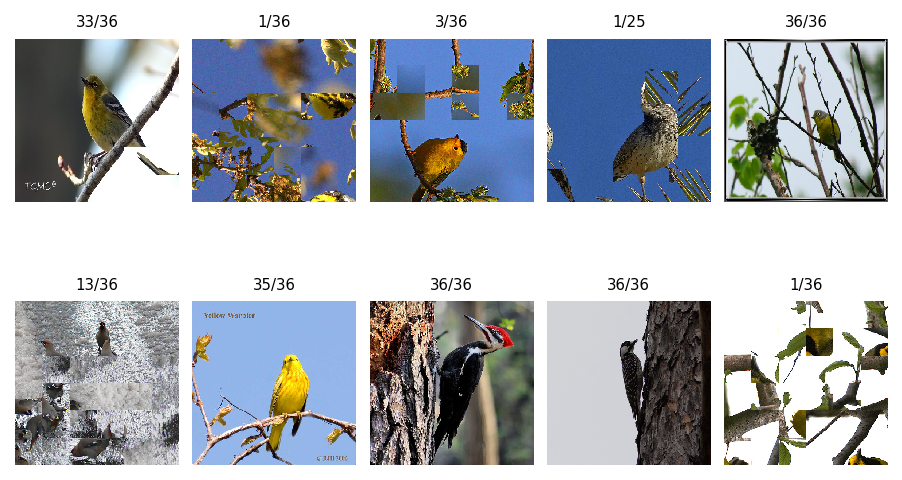
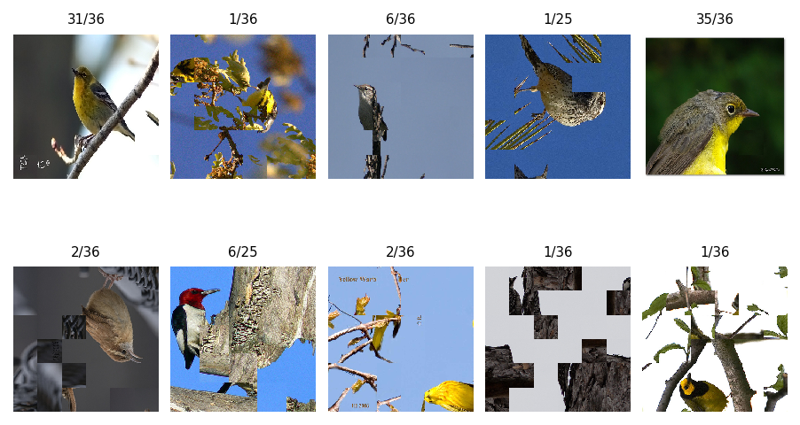
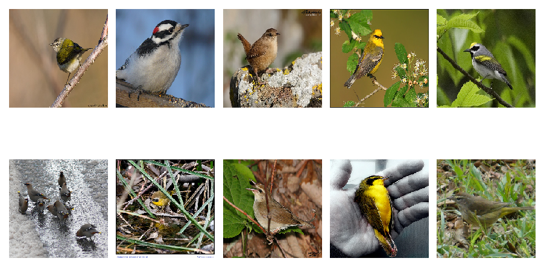
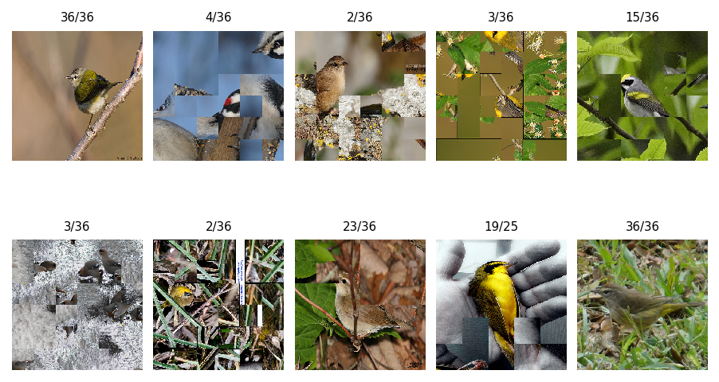

# Analysis of incorrectly solved puzzles

In this notebook, we look at the examples incorrectly solved by __AdjacencyClassifier_NoML__, __FromScratch__ and  __ResNetFT__ solvers. We display a thumbnail of the images incorrect solved and run the solvers again to see how they solved these images.


```python
from PIL import Image
import matplotlib.pyplot as plt
from matplotlib_venn import venn3, venn3_unweighted
import matplotlib.ticker as plticker
import os
import sys


import pprint
import itertools
from collections import defaultdict
import copy

# generate random integer values
import random
from random import seed
from random import randint
import numpy as np
import pandas as pd
from pylab import array
from random import sample
import math

import shelve

import torch
from torch.utils.data import Dataset, DataLoader, IterableDataset
from torchvision import transforms, utils
from torch import nn, optim
from torchvision import datasets, transforms
#from torchvision.utils import make_grid


from Puzzle_generator import *
from Checking_adjacency_dataset import *
from FromScratch_CNN import *
from ResNetFT_Finetuning import *
from Training_template import *
from Adjacency_distance import *
from Search_template import *
```

# Setting up


```python
if torch.cuda.is_available():
    GpuAvailable=True
    my_device = torch.device("cuda:0")   
    print("Running on the GPU")
else:
    GpuAvailable=False
    my_device = torch.device("cpu")
    print("Running on the CPU")


```

    Running on the CPU


```python
#Input global variables
my_test_dir = os.getenv("MY_TEST_DIR")
my_puzzle_square_piece_dim = 75

```


```python
my_learning_rate = 0.001
my_momentum = 0.9

```


```python
model_names = ['AdjacencyClassifier_NoML', 'FromScratch', 'ResNetFT']
models = [AdjacencyClassifier_NoML()]
for i in [1,2]:
    model_name=model_names[i]
    model,loss_criterion,optimizer = make_model_lc_optimizer(model_name,
                                                             my_learning_rate,
                                                             my_momentum)
    best_model_path=f"./best_model_for_{model_name}.pt"
    model, optimizer, epochs_trained, min_val_loss = load_checkpoint_gpu(best_model_path,
                                                                         model, 
                                                                         optimizer,
                                                                         GpuAvailable)
    model.eval()
    models.append(model)
    if 'GpuAvailable':
        models[i].to(my_device)

    
    
    
```

    Using FromScratch - Expect more number of parameters to learn!
    	 bigunit.0.conv1.weight
    	 bigunit.0.conv2.weight
    	 bigunit.0.unit.2.weight
    	 bigunit.0.unit.2.bias
    	 bigunit.0.unit.5.weight
    	 bigunit.0.unit.5.bias
    	 bigunit.1.conv1.weight
    	 bigunit.1.conv2.weight
    	 bigunit.1.unit.2.weight
    	 bigunit.1.unit.2.bias
    	 bigunit.1.unit.5.weight
    	 bigunit.1.unit.5.bias
    	 bigunit.2.conv1.weight
    	 bigunit.2.conv2.weight
    	 bigunit.2.unit.2.weight
    	 bigunit.2.unit.2.bias
    	 bigunit.2.unit.5.weight
    	 bigunit.2.unit.5.bias
    	 bigunit.3.conv1.weight
    	 bigunit.3.conv2.weight
    	 bigunit.3.unit.2.weight
    	 bigunit.3.unit.2.bias
    	 bigunit.3.unit.5.weight
    	 bigunit.3.unit.5.bias
    	 bigunit.4.conv1.weight
    	 bigunit.4.conv2.weight
    	 bigunit.4.unit.2.weight
    	 bigunit.4.unit.2.bias
    	 bigunit.4.unit.5.weight
    	 bigunit.4.unit.5.bias
    	 bigunit.5.conv1.weight
    	 bigunit.5.conv2.weight
    	 bigunit.5.unit.2.weight
    	 bigunit.5.unit.2.bias
    	 bigunit.5.unit.5.weight
    	 bigunit.5.unit.5.bias
    	 fc1.weight
    	 fc1.bias
    	 bn1.weight
    	 bn1.bias
    	 fc2.weight
    	 fc2.bias
    	 bn2.weight
    	 bn2.bias
    No_of_parameters to learn : 44
    Fine tuning ResNet - Expect more number of parameters to learn!
    	 conv1.weight
    	 bn1.weight
    	 bn1.bias
    	 layer1.0.conv1.weight
    	 layer1.0.bn1.weight
    	 layer1.0.bn1.bias
    	 layer1.0.conv2.weight
    	 layer1.0.bn2.weight
    	 layer1.0.bn2.bias
    	 layer1.1.conv1.weight
    	 layer1.1.bn1.weight
    	 layer1.1.bn1.bias
    	 layer1.1.conv2.weight
    	 layer1.1.bn2.weight
    	 layer1.1.bn2.bias
    	 layer2.0.conv1.weight
    	 layer2.0.bn1.weight
    	 layer2.0.bn1.bias
    	 layer2.0.conv2.weight
    	 layer2.0.bn2.weight
    	 layer2.0.bn2.bias
    	 layer2.0.downsample.0.weight
    	 layer2.0.downsample.1.weight
    	 layer2.0.downsample.1.bias
    	 layer2.1.conv1.weight
    	 layer2.1.bn1.weight
    	 layer2.1.bn1.bias
    	 layer2.1.conv2.weight
    	 layer2.1.bn2.weight
    	 layer2.1.bn2.bias
    	 layer3.0.conv1.weight
    	 layer3.0.bn1.weight
    	 layer3.0.bn1.bias
    	 layer3.0.conv2.weight
    	 layer3.0.bn2.weight
    	 layer3.0.bn2.bias
    	 layer3.0.downsample.0.weight
    	 layer3.0.downsample.1.weight
    	 layer3.0.downsample.1.bias
    	 layer3.1.conv1.weight
    	 layer3.1.bn1.weight
    	 layer3.1.bn1.bias
    	 layer3.1.conv2.weight
    	 layer3.1.bn2.weight
    	 layer3.1.bn2.bias
    	 layer4.0.conv1.weight
    	 layer4.0.bn1.weight
    	 layer4.0.bn1.bias
    	 layer4.0.conv2.weight
    	 layer4.0.bn2.weight
    	 layer4.0.bn2.bias
    	 layer4.0.downsample.0.weight
    	 layer4.0.downsample.1.weight
    	 layer4.0.downsample.1.bias
    	 layer4.1.conv1.weight
    	 layer4.1.bn1.weight
    	 layer4.1.bn1.bias
    	 layer4.1.conv2.weight
    	 layer4.1.bn2.weight
    	 layer4.1.bn2.bias
    	 fc.weight
    	 fc.bias
    No_of_parameters to learn : 62


```python
import time
def run_modified_solver(images,i):
    list_of_solved_images = []
    list_of_titles = []
    for pos,image_name in enumerate(images):
        my_model_name = model_names[i]
        my_model = models[i]
        output = modified_solve_example(img_path(image_name),my_puzzle_square_piece_dim,
                                        my_model_name, my_model,show_solving_progress=False,
                                        input_display=False)
        file_name, pieces, correct_position, correct_position_and_rotation, solved_image = output
        list_of_solved_images.append(solved_image)
        list_of_titles.append(f'{correct_position_and_rotation}/{pieces}')
        print(f"Image #{pos} processed")
        
    return list_of_solved_images, list_of_titles

```

# Thumbnails of incorrectly solved puzzles


```python
def img_path(image_name):
    return os.path.join(my_test_dir, '..', image_name)
```


```python
def show_images(images, cols, titles = [],  new_size = (300,300), is_pil= False):
    
    n = len(images)
    rows = math.ceil(n/cols)
    fig = plt.figure(dpi = 150)
    plt.rcParams.update({'font.size':6})
    for i in range(1, 1+n):
        if not is_pil:
            image_file_name = img_path(images[i-1])
            my_image = Image.open(image_file_name)
            my_image = my_image.resize(new_size) 
        else:
            my_image=images[i-1]
        ax = fig.add_subplot(rows,cols,i)
        ax.imshow(my_image)
        ax.axis('off')
        if titles:
            ax.set_title(titles[i-1])
    plt.tight_layout()
```


```python
# Getting the shelfed data
shelfFile = shelve.open('mydata')
unsolved_indices_dict = shelfFile["unsolved_indices_dict"] 
unsolved_images_dict = shelfFile["unsolved_images_dict"]
shelfFile.close()
```

## Unsolved by all of the models


```python
unsolved_by_all = list(unsolved_images_dict["All"])
show_images(unsolved_by_all, 6)
```





## Unsolved by AdjacencyClassifier_NoML but solved by ResNetFT


```python
unsolved_by_adj_no_ml_but_solved_by_resnet = list(unsolved_images_dict["AdjacencyClassifier_NoML"]-unsolved_images_dict["All"])
show_images(unsolved_by_adj_no_ml_but_solved_by_resnet, 4)
```





## Unsolved by ResNetFT but solved by AdjacencyClassifier_NoML


```python
unsolved_by_resnetft_but_solved_by_adj_no_ml = list(unsolved_images_dict["ResNetFT"]-unsolved_images_dict["All"])
show_images(unsolved_by_resnetft_but_solved_by_adj_no_ml, 4)
```





# AdjacencyClassifier_NoML

## Incorrectly solved


```python
unsolved_by_adj_no_ml = list(unsolved_images_dict["AdjacencyClassifier_NoML"])
show_images(unsolved_by_adj_no_ml, 5, [], (200,200))
```





## How AdjacencyClassifier_NoML solved these


```python
solved_imgs_by_adj_no_ml, titles = run_modified_solver(unsolved_by_adj_no_ml,0)
show_images(solved_imgs_by_adj_no_ml, 5, titles , new_size = (300,300), is_pil= True)
```

    Image #0 processed
    Image #1 processed
    Image #2 processed
    Image #3 processed
    Image #4 processed
    Image #5 processed
    Image #6 processed
    Image #7 processed
    Image #8 processed
    Image #9 processed





# ResNetFT

## Incorrectly solved


```python
unsolved_by_resnetft = list(unsolved_images_dict["ResNetFT"])
show_images(unsolved_by_adj_no_ml, 5, [], (200,200))


```


## How ResNetFT solved these


```python
solved_imgs_by_resnetft, titles = run_modified_solver(unsolved_by_resnetft,2)
show_images(solved_imgs_by_resnetft, 5, titles , new_size = (300,300), is_pil= True)
```

    Image #0 processed
    Image #1 processed
    Image #2 processed
    Image #3 processed
    Image #4 processed
    Image #5 processed
    Image #6 processed
    Image #7 processed
    Image #8 processed
    Image #9 processed





# FromScratch

## Incorrectly solved

FromScratch solved 50 of the 80 images incorrectly. We give a sample of size 10 below


```python
unsolved_by_fromscratch = list(unsolved_images_dict["FromScratch"])
unsolved_by_fromscratch = random.sample(unsolved_by_fromscratch,10) 
show_images(unsolved_by_fromscratch, 5, [], (200,200))
```





## How FromScratch solved these


```python
solved_imgs_by_fromscratch, titles = run_modified_solver(unsolved_by_fromscratch,1)
show_images(solved_imgs_by_fromscratch, 5, titles , new_size = (300,300), is_pil= True)
```

    Image #0 processed
    Image #1 processed
    Image #2 processed
    Image #3 processed
    Image #4 processed
    Image #5 processed
    Image #6 processed
    Image #7 processed
    Image #8 processed
    Image #9 processed





# Comments

We further visually investigated what the models did on puzzles they did not solve completely correctly. It turned out that the solvers were putting together several chunks of the puzzles correctly even if they were not placing the pieces in the correct positions in the puzzle board. Further, the solvers sometimes put back mostly correct but rotated versions of the images. Our current evaluation classified all these puzzles as _unsolved_.


If there are several similar pieces, and a solver chose and fit an incorrect piece, the puzzle of course will not be completely correctly solved. However the solver might (and did often) recover and get local chunks of the puzzle right. Perhaps a non-binary evaluation metric would aid in gauging the efficacy of these puzzle-solvers.


As a side note, we observe that there is some randomness in the search algorithm. If there are several choices for the best fit (piece, orientation, open-slot) combination, the solver arbitrarily picks one of them. This leads to slightly differing results on different runs


```python

```
