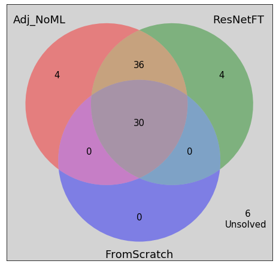

# Evaluation and comparisons of solvers

We have three jigsaw puzzle solvers based on the following models which solve the __left-right-adjacency-problem__, namely

* AdjacencyClassifier_NoML 
* FromScratch
* ResNetFT


To avoid introducing more terms, we call the jigsaw solvers by the names of the models they are based upon. We evaulate these solvers on 80 images from the CUB-200 test data set and compare their respective performances


```python
from PIL import Image
import matplotlib.pyplot as plt
from matplotlib_venn import venn3, venn3_unweighted
import matplotlib.ticker as plticker
import os
import sys


import pprint
import itertools
from collections import defaultdict
import copy

# generate random integer values
import random
from random import seed
from random import randint
import numpy as np
import pandas as pd
from pylab import array
from random import sample
import math

import shelve

import torch
from torch.utils.data import Dataset, DataLoader, IterableDataset
from torchvision import transforms, utils
from torch import nn, optim
from torchvision import datasets, transforms
#from torchvision.utils import make_grid


from Puzzle_generator import *
from Checking_adjacency_dataset import *
from FromScratch_CNN import *
from ResNetFT_Finetuning import *
from Training_template import *
from Adjacency_distance import *
from Search_template_gpu import *
```

# Setting up

## Checking GPU availability


```python
if torch.cuda.is_available():
    GpuAvailable=True
    my_device = torch.device("cuda:0")   
    print("Running on the GPU")
else:
    GpuAvailable=False
    my_device = torch.device("cpu")
    print("Running on the CPU")


```

    Running on the CPU


## Inputs


```python
#Input global variables
my_test_dir = os.getenv("MY_TEST_DIR")
no_of_test_images = 80
my_puzzle_square_piece_dim = 75

```

## Loading models


```python
my_learning_rate = 0.001
my_momentum = 0.9

```


```python
model_names = ['AdjacencyClassifier_NoML', 'FromScratch', 'ResNetFT']
models = [AdjacencyClassifier_NoML()]
for i in [1,2]:
    model_name=model_names[i]
    model,loss_criterion,optimizer = make_model_lc_optimizer(model_name,
                                                             my_learning_rate,
                                                             my_momentum)
    best_model_path=f"./best_model_for_{model_name}.pt"
    model, optimizer, epochs_trained, min_val_loss = load_checkpoint_gpu(best_model_path,
                                                                         model, 
                                                                         optimizer,
                                                                         GpuAvailable)
    model.eval()
    models.append(model)
    if 'GpuAvailable':
        models[i].to(my_device)

    
    
    
```

    Using FromScratch - Expect more number of parameters to learn!
    	 bigunit.0.conv1.weight
    	 bigunit.0.conv2.weight
    	 bigunit.0.unit.2.weight
    	 bigunit.0.unit.2.bias
    	 bigunit.0.unit.5.weight
    	 bigunit.0.unit.5.bias
    	 bigunit.1.conv1.weight
    	 bigunit.1.conv2.weight
    	 bigunit.1.unit.2.weight
    	 bigunit.1.unit.2.bias
    	 bigunit.1.unit.5.weight
    	 bigunit.1.unit.5.bias
    	 bigunit.2.conv1.weight
    	 bigunit.2.conv2.weight
    	 bigunit.2.unit.2.weight
    	 bigunit.2.unit.2.bias
    	 bigunit.2.unit.5.weight
    	 bigunit.2.unit.5.bias
    	 bigunit.3.conv1.weight
    	 bigunit.3.conv2.weight
    	 bigunit.3.unit.2.weight
    	 bigunit.3.unit.2.bias
    	 bigunit.3.unit.5.weight
    	 bigunit.3.unit.5.bias
    	 bigunit.4.conv1.weight
    	 bigunit.4.conv2.weight
    	 bigunit.4.unit.2.weight
    	 bigunit.4.unit.2.bias
    	 bigunit.4.unit.5.weight
    	 bigunit.4.unit.5.bias
    	 bigunit.5.conv1.weight
    	 bigunit.5.conv2.weight
    	 bigunit.5.unit.2.weight
    	 bigunit.5.unit.2.bias
    	 bigunit.5.unit.5.weight
    	 bigunit.5.unit.5.bias
    	 fc1.weight
    	 fc1.bias
    	 bn1.weight
    	 bn1.bias
    	 fc2.weight
    	 fc2.bias
    	 bn2.weight
    	 bn2.bias
    No_of_parameters to learn : 44
    Fine tuning ResNet - Expect more number of parameters to learn!
    	 conv1.weight
    	 bn1.weight
    	 bn1.bias
    	 layer1.0.conv1.weight
    	 layer1.0.bn1.weight
    	 layer1.0.bn1.bias
    	 layer1.0.conv2.weight
    	 layer1.0.bn2.weight
    	 layer1.0.bn2.bias
    	 layer1.1.conv1.weight
    	 layer1.1.bn1.weight
    	 layer1.1.bn1.bias
    	 layer1.1.conv2.weight
    	 layer1.1.bn2.weight
    	 layer1.1.bn2.bias
    	 layer2.0.conv1.weight
    	 layer2.0.bn1.weight
    	 layer2.0.bn1.bias
    	 layer2.0.conv2.weight
    	 layer2.0.bn2.weight
    	 layer2.0.bn2.bias
    	 layer2.0.downsample.0.weight
    	 layer2.0.downsample.1.weight
    	 layer2.0.downsample.1.bias
    	 layer2.1.conv1.weight
    	 layer2.1.bn1.weight
    	 layer2.1.bn1.bias
    	 layer2.1.conv2.weight
    	 layer2.1.bn2.weight
    	 layer2.1.bn2.bias
    	 layer3.0.conv1.weight
    	 layer3.0.bn1.weight
    	 layer3.0.bn1.bias
    	 layer3.0.conv2.weight
    	 layer3.0.bn2.weight
    	 layer3.0.bn2.bias
    	 layer3.0.downsample.0.weight
    	 layer3.0.downsample.1.weight
    	 layer3.0.downsample.1.bias
    	 layer3.1.conv1.weight
    	 layer3.1.bn1.weight
    	 layer3.1.bn1.bias
    	 layer3.1.conv2.weight
    	 layer3.1.bn2.weight
    	 layer3.1.bn2.bias
    	 layer4.0.conv1.weight
    	 layer4.0.bn1.weight
    	 layer4.0.bn1.bias
    	 layer4.0.conv2.weight
    	 layer4.0.bn2.weight
    	 layer4.0.bn2.bias
    	 layer4.0.downsample.0.weight
    	 layer4.0.downsample.1.weight
    	 layer4.0.downsample.1.bias
    	 layer4.1.conv1.weight
    	 layer4.1.bn1.weight
    	 layer4.1.bn1.bias
    	 layer4.1.conv2.weight
    	 layer4.1.bn2.weight
    	 layer4.1.bn2.bias
    	 fc.weight
    	 fc.bias
    No_of_parameters to learn : 62


## Solver evaluation functions


```python
def calculate_example_metric(file_name, puzzle_square_piece_dim,model_name, model, puzzle_input,device, show_solving_progress=False,input_display=False):
    if show_solving_progress:
        print(f"Solving {file_name}...")
    rows = puzzle_input[0]
    cols = puzzle_input[1] 
    no_of_pieces = rows*cols
    top_left_piece_new_label = puzzle_input[2] 
    top_left_piece_orientation = puzzle_input[3] 
    new_to_old_label_dict = puzzle_input[4]
    shuffled_puzzle_pieces_np = puzzle_input[5]
    board = solve_puzzle(rows, cols,top_left_piece_new_label,top_left_piece_orientation, 
                         shuffled_puzzle_pieces_np, puzzle_square_piece_dim,model_name, model,device,show_solving_progress)
    if show_solving_progress:
        print("*****************")
        print(f"Solved puzzle using {model_name} solver")
        board.display(puzzle_square_piece_dim)    
    information_dict = board.information_dict
    predicted_new_to_old_dict = board.predicted_new_to_old_dict
    correct_position = 0
    correct_position_and_rotation = 0
    for k in new_to_old_label_dict:
        if new_to_old_label_dict[k][:2] == predicted_new_to_old_dict[k][:2]:
            correct_position += 1
            if new_to_old_label_dict[k][2] == predicted_new_to_old_dict[k][2]:
                correct_position_and_rotation += 1
    if show_solving_progress:
        print("*******************")
        print(f"In correct position: {correct_position}")
        print(f"In correct position and rotation: {correct_position_and_rotation}")
    return(no_of_pieces, correct_position, correct_position_and_rotation)

    

```


```python
import time 
def run_solver(image_name,i,eval_df,count,row_number):
    my_model_name = model_names[i]
    my_model = models[i]
    start_time = time.time()
    my_input = get_puzzle_pieces(image_name,my_puzzle_square_piece_dim, display=False)
    pieces,correct_pos,correct_pos_and_rotation = calculate_example_metric(image_name,my_puzzle_square_piece_dim,
                                                                           my_model_name, my_model,my_input,my_device,
                                                                           show_solving_progress=False,
                                                                           input_display=False)
    time_taken = round(time.time()-start_time,2)
    results_dict = {"model" : my_model_name,
                    "image_name": image_name,
                    "image_index" : count,
                    "no_of_pieces": pieces,
                    "correct_pos": correct_pos, 
                    "correct_pos_and_orientation": correct_pos_and_rotation,
                    "time_taken": time_taken}
    eval_df.loc[row_number] = pd.Series(results_dict)
        
```

## Dataframe to store evaluation results


```python
column_names = ["model","image_name", "image_index" , "no_of_pieces", "correct_pos", "correct_pos_and_orientation", "time_taken"]
eval_results_df = pd.DataFrame(columns = column_names, index = list(range(1,no_of_test_images +1)))
```

# Evaluation


```python
count = 0
row_number = 0
done = False
for folder in sample(os.listdir(my_test_dir), len(os.listdir(my_test_dir))):
    folder_path = os.path.join(my_test_dir,folder)
    images_from_this_folder=0
    for image_name in sample(os.listdir(folder_path), len(os.listdir(folder_path))):
        count += 1
        images_from_this_folder += 1
        image_name = os.path.join(folder_path, image_name)
        for i in range(1,4):
            row_number += 1
            run_solver(image_name,i,eval_results_df,count,row_number)
            eval_results_df.to_csv('eval_results.csv')
            print(f"Processed Image #{count} with model {model_names[i]}")
        if count >= no_of_test_images:
            done = True
            break
        if images_from_this_folder >= 2:
            break
    
    if done:
        break


```

_The evaluation was run on Google Colabs so as to use GPU services and the dataframe was stored as a csv file called eval_results_final.csv_

# Dataframe manipulation


```python
#Read csv data and put it into a dataframe
eval_results_df= pd.read_csv('eval_results_final.csv')

```


```python
#Get dataframe columns
eval_results_df.columns
```


    Index(['Unnamed: 0', 'model', 'image_name', 'image_index', 'no_of_pieces',
           'correct_pos', 'correct_pos_and_orientation', 'time_taken'],
          dtype='object')


```python
#Drop unnecessary column
del eval_results_df['Unnamed: 0']
```


```python
#Add a new column called solved (1 if the model solves the puzzle completely correctly, 0 otherwise)
eval_results_df['solved'] = eval_results_df.apply(lambda row: 1 if row.no_of_pieces == row.correct_pos_and_orientation else 0, axis=1)
```


```python
eval_results_df.head(6)
```


<div>
<style scoped>
    .dataframe tbody tr th:only-of-type {
        vertical-align: middle;
    }

    .dataframe tbody tr th {
        vertical-align: top;
    }

    .dataframe thead th {
        text-align: right;
    }
</style>
<table border="1" class="dataframe">
  <thead>
    <tr style="text-align: right;">
      <th></th>
      <th>model</th>
      <th>image_name</th>
      <th>image_index</th>
      <th>no_of_pieces</th>
      <th>correct_pos</th>
      <th>correct_pos_and_orientation</th>
      <th>time_taken</th>
      <th>solved</th>
    </tr>
  </thead>
  <tbody>
    <tr>
      <th>0</th>
      <td>AdjacencyClassifier_NoML</td>
      <td>CUB_200_test/172.Nashville_Warbler/Nashville_W...</td>
      <td>1</td>
      <td>36</td>
      <td>36</td>
      <td>36</td>
      <td>13.46</td>
      <td>1</td>
    </tr>
    <tr>
      <th>1</th>
      <td>FromScratch</td>
      <td>CUB_200_test/172.Nashville_Warbler/Nashville_W...</td>
      <td>1</td>
      <td>36</td>
      <td>36</td>
      <td>36</td>
      <td>21.28</td>
      <td>1</td>
    </tr>
    <tr>
      <th>2</th>
      <td>ResNetFT</td>
      <td>CUB_200_test/172.Nashville_Warbler/Nashville_W...</td>
      <td>1</td>
      <td>36</td>
      <td>36</td>
      <td>36</td>
      <td>25.64</td>
      <td>1</td>
    </tr>
    <tr>
      <th>3</th>
      <td>AdjacencyClassifier_NoML</td>
      <td>CUB_200_test/172.Nashville_Warbler/Nashville_W...</td>
      <td>2</td>
      <td>36</td>
      <td>17</td>
      <td>17</td>
      <td>13.31</td>
      <td>0</td>
    </tr>
    <tr>
      <th>4</th>
      <td>FromScratch</td>
      <td>CUB_200_test/172.Nashville_Warbler/Nashville_W...</td>
      <td>2</td>
      <td>36</td>
      <td>1</td>
      <td>1</td>
      <td>21.95</td>
      <td>0</td>
    </tr>
    <tr>
      <th>5</th>
      <td>ResNetFT</td>
      <td>CUB_200_test/172.Nashville_Warbler/Nashville_W...</td>
      <td>2</td>
      <td>36</td>
      <td>36</td>
      <td>36</td>
      <td>23.83</td>
      <td>1</td>
    </tr>
  </tbody>
</table>
</div>


```python
#creating dataframes for individual models
model_names = ['AdjacencyClassifier_NoML', 'FromScratch', 'ResNetFT']
models_stats_dict= {}
for model_name in model_names:
    models_stats_dict[model_name]=eval_results_df[eval_results_df.model==model_name].reset_index(drop=True)

```

# Evaluation

## Sizes of test puzzles


```python
sizes_of_puzzles = list(eval_results_df.no_of_pieces.unique())
```


```python
puzzle_size_freq = eval_results_df['no_of_pieces'].value_counts()//3
```


```python
puzzle_size_freq = puzzle_size_freq.rename_axis('puzzle_sizes').reset_index(name='no_of_puzzles')
```


```python
puzzle_size_freq
```


<div>
<style scoped>
    .dataframe tbody tr th:only-of-type {
        vertical-align: middle;
    }

    .dataframe tbody tr th {
        vertical-align: top;
    }

    .dataframe thead th {
        text-align: right;
    }
</style>
<table border="1" class="dataframe">
  <thead>
    <tr style="text-align: right;">
      <th></th>
      <th>puzzle_sizes</th>
      <th>no_of_puzzles</th>
    </tr>
  </thead>
  <tbody>
    <tr>
      <th>0</th>
      <td>36</td>
      <td>67</td>
    </tr>
    <tr>
      <th>1</th>
      <td>25</td>
      <td>11</td>
    </tr>
    <tr>
      <th>2</th>
      <td>16</td>
      <td>2</td>
    </tr>
  </tbody>
</table>
</div>


## Statistics


```python
eval_stats_df = pd.DataFrame(columns=model_names, index=['avg_time_taken','percentage_solved'])
```


```python
#average time taken
avg_time_taken = {}
for model_name in model_names:
    avg_time_taken[model_name] =models_stats_dict[model_name]["time_taken"].mean()
    
eval_stats_df.loc['avg_time_taken'] = pd.Series(avg_time_taken)
```


```python
#percentage solved
percentage_solved = {}
for model_name in model_names:
    percentage_solved[model_name] = models_stats_dict[model_name]["solved"].sum()/no_of_test_images
    
eval_stats_df.loc['percentage_solved'] = pd.Series(percentage_solved)
```


```python
#average puzzle size
avg_puzzle_sizes = {}
for model_name in model_names:
    avg_puzzle_sizes[model_name] =models_stats_dict[model_name]["no_of_pieces"].mean()
    
eval_stats_df.loc['avg_puzzle_sizes'] = pd.Series(avg_puzzle_sizes)
```


```python
eval_stats_df
```


<div>
<style scoped>
    .dataframe tbody tr th:only-of-type {
        vertical-align: middle;
    }

    .dataframe tbody tr th {
        vertical-align: top;
    }

    .dataframe thead th {
        text-align: right;
    }
</style>
<table border="1" class="dataframe">
  <thead>
    <tr style="text-align: right;">
      <th></th>
      <th>AdjacencyClassifier_NoML</th>
      <th>FromScratch</th>
      <th>ResNetFT</th>
    </tr>
  </thead>
  <tbody>
    <tr>
      <th>avg_time_taken</th>
      <td>11.2126</td>
      <td>18.9795</td>
      <td>23.0482</td>
    </tr>
    <tr>
      <th>percentage_solved</th>
      <td>0.875</td>
      <td>0.375</td>
      <td>0.875</td>
    </tr>
    <tr>
      <th>avg_puzzle_sizes</th>
      <td>33.9875</td>
      <td>33.9875</td>
      <td>33.9875</td>
    </tr>
  </tbody>
</table>
</div>


## Comparison of models


```python
#examples' solved statuses vs models
comparison_df = pd.DataFrame(columns=model_names, index=list(range(no_of_test_images)))

for model_name in model_names:
    comparison_df[model_name]= models_stats_dict[model_name]["solved"]
```


```python
#comparing the symmetric difference of two models at a time
model_name_pairs = []
for i,j in [(0,1), (0,2), (1,2)]:
    
    models_in_comparison = model_names[i]+"/"+model_names[j]
    model_name_pairs.append(models_in_comparison)
    comparison_df[models_in_comparison] = comparison_df.apply(lambda row: row[model_names[i]] ^ row[model_names[j]], axis=1)
```


```python
for model_name_pair in model_name_pairs:
    first_model = model_name_pair.split("/")[0]
    second_model = model_name_pair.split("/")[1]
    
    a = eval_stats_df.loc['percentage_solved'][first_model]*no_of_test_images 
    b = eval_stats_df.loc['percentage_solved'][second_model]*no_of_test_images
    #a+b-2x = comparison_df[model_name_pair].sum()
    #solved_jointly = x
    solved_jointly = int((a+b-comparison_df[model_name_pair].sum())/2)
    solved_by_first_model_alone = int(a - solved_jointly)
    solved_by_second_model_alone = int(b - solved_jointly)
    unsolved_jointly = int(no_of_test_images - (a+b-solved_jointly))
    print("")
    print(f"Comparing {first_model} and {second_model}")
    print("")
    print(f"Solved jointly = {solved_jointly}")
    print(f"Unsolved jointly = {unsolved_jointly}")
    print(f"Solved by {first_model} alone = {solved_by_first_model_alone}")
    print(f"Solved by {second_model} alone = {solved_by_second_model_alone}")
    print("")
    print("********************************")
    
    
```

    
    Comparing AdjacencyClassifier_NoML and FromScratch
    
    Solved jointly = 30
    Unsolved jointly = 10
    Solved by AdjacencyClassifier_NoML alone = 40
    Solved by FromScratch alone = 0
    
    ********************************
    
    Comparing AdjacencyClassifier_NoML and ResNetFT
    
    Solved jointly = 66
    Unsolved jointly = 6
    Solved by AdjacencyClassifier_NoML alone = 4
    Solved by ResNetFT alone = 4
    
    ********************************
    
    Comparing FromScratch and ResNetFT
    
    Solved jointly = 30
    Unsolved jointly = 10
    Solved by FromScratch alone = 0
    Solved by ResNetFT alone = 40
    
    ********************************


```python
#Examples solved by all three models
comparison_df["solved_by_all_three"] = comparison_df.apply(lambda row: 1 if row[model_names[0]]==1 and row[model_names[1]] == 1 and row[model_names[2]]==1 else 0, axis=1)
```


```python
solved_by_all_three = comparison_df["solved_by_all_three"].sum()
```


```python
#Examples solved by at least one of the three models
comparison_df["solved_by_atleast_one"] = comparison_df.apply(lambda row: row[model_names[0]] + row[model_names[1]] + row[model_names[2]], axis=1)
```


```python
solved_by_atleast_one = len(comparison_df[comparison_df["solved_by_atleast_one"]>0])
```


```python
solved_by_none = len(comparison_df[comparison_df["solved_by_atleast_one"]<=0])
```


```python
print(f'Solved by all the three models = {solved_by_all_three}')
print(f'Solved by at least one model = {solved_by_atleast_one}')
print(f'Solved by none of the models = {solved_by_none}')
```

    Solved by all the three models = 30
    Solved by at least one model = 74
    Solved by none of the models = 6


## Examples on which models underperformed

### Extracting information from the dataframes


```python
unsolved_indices_dict = {}
unsolved_indices_dict["All"]= list(comparison_df[comparison_df["solved_by_atleast_one"]<=0].index)
for model_name in model_names:
    unsolved_indices_dict[model_name] = list(models_stats_dict[model_name][models_stats_dict[model_name]["solved"]==0].index)

```


```python
unsolved_images_dict = {}
for key in unsolved_indices_dict:
    unsolved_images_dict[key] = set()
    for i in unsolved_indices_dict[key]:
        unsolved_images_dict[key].add(models_stats_dict["AdjacencyClassifier_NoML"].loc[i]["image_name"])
```

### Saving incorrectly solved examples for further analysis


```python
shelfFile = shelve.open('mydata')
shelfFile["unsolved_indices_dict"] = unsolved_indices_dict
shelfFile["unsolved_images_dict"] = unsolved_images_dict
shelfFile.close()
```

# Results

## Summary

There were 67 _six-by-six_ puzzles, 11 _five-by-five_ puzzles and 2 _four-by-four_ puzzles in the evaluation set


```python
puzzle_size_freq
```


<div>
<style scoped>
    .dataframe tbody tr th:only-of-type {
        vertical-align: middle;
    }

    .dataframe tbody tr th {
        vertical-align: top;
    }

    .dataframe thead th {
        text-align: right;
    }
</style>
<table border="1" class="dataframe">
  <thead>
    <tr style="text-align: right;">
      <th></th>
      <th>puzzle_sizes</th>
      <th>no_of_puzzles</th>
    </tr>
  </thead>
  <tbody>
    <tr>
      <th>0</th>
      <td>36</td>
      <td>67</td>
    </tr>
    <tr>
      <th>1</th>
      <td>25</td>
      <td>11</td>
    </tr>
    <tr>
      <th>2</th>
      <td>16</td>
      <td>2</td>
    </tr>
  </tbody>
</table>
</div>


Both the _AdjacencyClassifier_NoML_ and the _ResNetFT_ solved 87.5 % of the puzzles completely correctly. _FromScratch_ underperformed by solving only 37.5 % of the puzzles completely correctly.


```python
eval_stats_df
```


<div>
<style scoped>
    .dataframe tbody tr th:only-of-type {
        vertical-align: middle;
    }

    .dataframe tbody tr th {
        vertical-align: top;
    }

    .dataframe thead th {
        text-align: right;
    }
</style>
<table border="1" class="dataframe">
  <thead>
    <tr style="text-align: right;">
      <th></th>
      <th>AdjacencyClassifier_NoML</th>
      <th>FromScratch</th>
      <th>ResNetFT</th>
    </tr>
  </thead>
  <tbody>
    <tr>
      <th>avg_time_taken</th>
      <td>11.2126</td>
      <td>18.9795</td>
      <td>23.0482</td>
    </tr>
    <tr>
      <th>percentage_solved</th>
      <td>0.875</td>
      <td>0.375</td>
      <td>0.875</td>
    </tr>
    <tr>
      <th>avg_puzzle_sizes</th>
      <td>33.9875</td>
      <td>33.9875</td>
      <td>33.9875</td>
    </tr>
  </tbody>
</table>
</div>


## A venn diagram to visualize the comparisons


```python
fig = plt.figure()
plt.rcParams.update({'font.size':15})
v = venn3_unweighted(subsets = (4, 4, 36, 0,0,0,30), set_labels=('Adj_NoML', 'ResNetFT', 'FromScratch'))
plt.axis("on")
plt.text(0.45, -0.55, '       6\nUnsolved')
plt.gca().set_facecolor('lightgray')
fig.tight_layout(pad=-5);
```





## Comments

The current evaluation classifies a puzzle as _unsolved_ even if the models got a major chunk right but placed it incorrectly on the board. So we will further visually investigate what the models did on puzzles they did not solve completey correctly. 


```python

```
