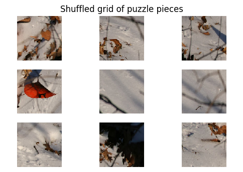
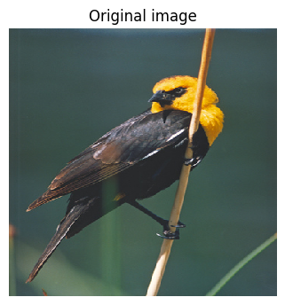
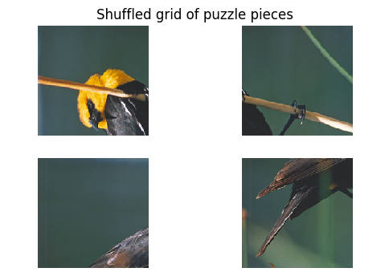
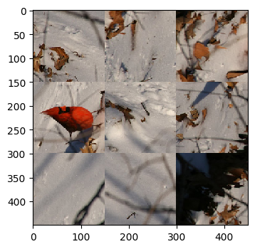
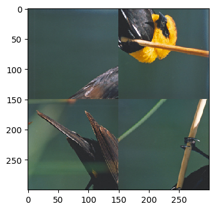
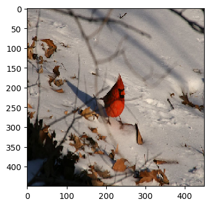
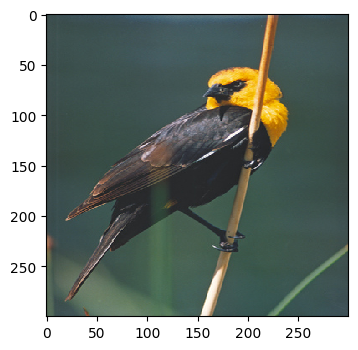

# Solvers in action

We have three models which solve the __left-right-adjacency-problem__, namely

* AdjacencyClassifier_NoML 
* FromScratch
* ResNetFT

These models, used with our search template, yield three solvers, which we'll call by the same names. For comparison, let's throw in the __RandomScorer__ Solver (which is based on the dummy model that assigns adjacency scores randomly).

We run these solvers on two puzzles for a qualitative analysis.


```python
from PIL import Image
import matplotlib.pyplot as plt
import matplotlib.ticker as plticker
import os
from itertools import product


import pprint
import itertools
from collections import defaultdict
import copy

# generate random integer values
import random
from random import seed
from random import randint
import numpy as np
from pylab import array
from random import sample
import math

from Puzzle_generator import *
from Checking_adjacency_dataset import *
from FromScratch_CNN import *
from ResNetFT_Finetuning import *
from Training_template import *
from Adjacency_distance import *
from Search_template import *

import torch
from torch.utils.data import Dataset, DataLoader, IterableDataset
from torchvision import transforms, utils
from torch import nn, optim
from torchvision import datasets, transforms
#from torchvision.utils import make_grid
```


```python
import time

```

# Checking GPU availability


```python
if torch.cuda.is_available():
    GpuAvailable=True
    my_device = torch.device("cuda:0")   
    print("Running on the GPU")
else:
    GpuAvailable=False
    my_device = torch.device("cpu")
    print("Running on the CPU")


```

    Running on the CPU


# Loading models


```python
my_learning_rate = 0.001
my_momentum = 0.9
```


```python
model_names = ['RandomScorer','AdjacencyClassifier_NoML', 'FromScratch', 'ResNetFT']
models = [None, AdjacencyClassifier_NoML()]
for i in [2,3]:
    model_name=model_names[i]
    model,loss_criterion,optimizer = make_model_lc_optimizer(model_name,
                                                             my_learning_rate,
                                                             my_momentum)
    best_model_path=f"./best_model_for_{model_name}.pt"
    model, optimizer, epochs_trained, min_val_loss = load_checkpoint_gpu(best_model_path,
                                                                         model, 
                                                                         optimizer,
                                                                         GpuAvailable)
    model.eval()
    models.append(model)
    if 'GpuAvailable':
        models[i].to(my_device)

    
    
    
```

    Using FromScratch - Expect more number of parameters to learn!
    	 bigunit.0.conv1.weight
    	 bigunit.0.conv2.weight
    	 bigunit.0.unit.2.weight
    	 bigunit.0.unit.2.bias
    	 bigunit.0.unit.5.weight
    	 bigunit.0.unit.5.bias
    	 bigunit.1.conv1.weight
    	 bigunit.1.conv2.weight
    	 bigunit.1.unit.2.weight
    	 bigunit.1.unit.2.bias
    	 bigunit.1.unit.5.weight
    	 bigunit.1.unit.5.bias
    	 bigunit.2.conv1.weight
    	 bigunit.2.conv2.weight
    	 bigunit.2.unit.2.weight
    	 bigunit.2.unit.2.bias
    	 bigunit.2.unit.5.weight
    	 bigunit.2.unit.5.bias
    	 bigunit.3.conv1.weight
    	 bigunit.3.conv2.weight
    	 bigunit.3.unit.2.weight
    	 bigunit.3.unit.2.bias
    	 bigunit.3.unit.5.weight
    	 bigunit.3.unit.5.bias
    	 bigunit.4.conv1.weight
    	 bigunit.4.conv2.weight
    	 bigunit.4.unit.2.weight
    	 bigunit.4.unit.2.bias
    	 bigunit.4.unit.5.weight
    	 bigunit.4.unit.5.bias
    	 bigunit.5.conv1.weight
    	 bigunit.5.conv2.weight
    	 bigunit.5.unit.2.weight
    	 bigunit.5.unit.2.bias
    	 bigunit.5.unit.5.weight
    	 bigunit.5.unit.5.bias
    	 fc1.weight
    	 fc1.bias
    	 bn1.weight
    	 bn1.bias
    	 fc2.weight
    	 fc2.bias
    	 bn2.weight
    	 bn2.bias
    No_of_parameters to learn : 44
    Fine tuning ResNet - Expect more number of parameters to learn!
    	 conv1.weight
    	 bn1.weight
    	 bn1.bias
    	 layer1.0.conv1.weight
    	 layer1.0.bn1.weight
    	 layer1.0.bn1.bias
    	 layer1.0.conv2.weight
    	 layer1.0.bn2.weight
    	 layer1.0.bn2.bias
    	 layer1.1.conv1.weight
    	 layer1.1.bn1.weight
    	 layer1.1.bn1.bias
    	 layer1.1.conv2.weight
    	 layer1.1.bn2.weight
    	 layer1.1.bn2.bias
    	 layer2.0.conv1.weight
    	 layer2.0.bn1.weight
    	 layer2.0.bn1.bias
    	 layer2.0.conv2.weight
    	 layer2.0.bn2.weight
    	 layer2.0.bn2.bias
    	 layer2.0.downsample.0.weight
    	 layer2.0.downsample.1.weight
    	 layer2.0.downsample.1.bias
    	 layer2.1.conv1.weight
    	 layer2.1.bn1.weight
    	 layer2.1.bn1.bias
    	 layer2.1.conv2.weight
    	 layer2.1.bn2.weight
    	 layer2.1.bn2.bias
    	 layer3.0.conv1.weight
    	 layer3.0.bn1.weight
    	 layer3.0.bn1.bias
    	 layer3.0.conv2.weight
    	 layer3.0.bn2.weight
    	 layer3.0.bn2.bias
    	 layer3.0.downsample.0.weight
    	 layer3.0.downsample.1.weight
    	 layer3.0.downsample.1.bias
    	 layer3.1.conv1.weight
    	 layer3.1.bn1.weight
    	 layer3.1.bn1.bias
    	 layer3.1.conv2.weight
    	 layer3.1.bn2.weight
    	 layer3.1.bn2.bias
    	 layer4.0.conv1.weight
    	 layer4.0.bn1.weight
    	 layer4.0.bn1.bias
    	 layer4.0.conv2.weight
    	 layer4.0.bn2.weight
    	 layer4.0.bn2.bias
    	 layer4.0.downsample.0.weight
    	 layer4.0.downsample.1.weight
    	 layer4.0.downsample.1.bias
    	 layer4.1.conv1.weight
    	 layer4.1.bn1.weight
    	 layer4.1.bn1.bias
    	 layer4.1.conv2.weight
    	 layer4.1.bn2.weight
    	 layer4.1.bn2.bias
    	 fc.weight
    	 fc.bias
    No_of_parameters to learn : 62


# Solver helper function


```python
def run_solver(images,i):
    for image_name in images:
        my_model_name = model_names[i]
        my_model = models[i]
        print("")
        solve_example(image_name,my_puzzle_square_piece_dim,
                      my_model_name, my_model,
                      show_solving_progress=False,input_display=False)
        print("")
    
```

# The inputs


```python
puzzle_images = ['image_1.jpg','image_2.jpg']
my_puzzle_square_piece_dim = 150
```


```python
input_0 = get_puzzle_pieces(puzzle_images[0],my_puzzle_square_piece_dim, display=True)
```

    ****************
    puzzle_piece_length is 150
    puzzle_piece_width is 150
    no of rows are 3
    no of cols are 3
    no_of_puzzle_pieces are 9
    ****************





```python
input_1 = get_puzzle_pieces(puzzle_images[1],my_puzzle_square_piece_dim, display=True)
```

    ****************
    puzzle_piece_length is 150
    puzzle_piece_width is 150
    no of rows are 2
    no of cols are 2
    no_of_puzzle_pieces are 4
    ****************








# Running the solvers

## RandomScorer


```python
start_time = time.time()
run_solver(puzzle_images,0)
print(f"Time take for RandomScorer = {time.time()-start_time} seconds")
```

    
    Solving image_1.jpg...
    *****************
    Solved puzzle using RandomScorer solver





    *******************
    In correct position: 1
    In correct position and rotation: 1
    
    
    Solving image_2.jpg...
    *****************
    Solved puzzle using RandomScorer solver





    *******************
    In correct position: 4
    In correct position and rotation: 1
    
    Time take for RandomScorer = 1.2346370220184326 seconds


## AdjacencyClassifier_NoML 


```python
start_time = time.time()
run_solver(puzzle_images,1)
print(f"Time take for AdjacencyClassifier_NoML  = {time.time()-start_time} seconds")
```

    
    Solving image_1.jpg...
    *****************
    Solved puzzle using AdjacencyClassifier_NoML solver





    *******************
    In correct position: 9
    In correct position and rotation: 9
    
    
    Solving image_2.jpg...
    *****************
    Solved puzzle using AdjacencyClassifier_NoML solver





    *******************
    In correct position: 4
    In correct position and rotation: 4
    
    Time take for AdjacencyClassifier_NoML  = 1.412754774093628 seconds


## FromScratch


```python
start_time = time.time()
run_solver(puzzle_images,2)
print(f"Time take for FromScratch = {time.time()-start_time} seconds")
```

    
    Solving image_1.jpg...
    *****************
    Solved puzzle using FromScratch solver


    *******************
    In correct position: 9
    In correct position and rotation: 9
    
    
    Solving image_2.jpg...
    *****************
    Solved puzzle using FromScratch solver


    *******************
    In correct position: 4
    In correct position and rotation: 4
    
    Time take for FromScratch = 5.606786012649536 seconds


## ResNetFT


```python
start_time = time.time()
run_solver(puzzle_images,3)
print(f"Time take for ResNetFT = {time.time()-start_time} seconds")
```

    
    Solving image_1.jpg...
    *****************
    Solved puzzle using ResNetFT solver


    *******************
    In correct position: 9
    In correct position and rotation: 9
    
    
    Solving image_2.jpg...
    *****************
    Solved puzzle using ResNetFT solver


    *******************
    In correct position: 4
    In correct position and rotation: 4
    
    Time take for ResNetFT = 29.184174060821533 seconds


# Summary

Looking cursorily at the two input puzzles, it looks like all the three models solve the puzzles completely correctly!


For the two examples put together, AdjacencyClassifier_NoML is the quickest, taking around 1.4 seconds, FromScratch takes 5 seconds, while ResNetFT takes nearly 30 seconds. Note that we are running on a CPU though


Further quantitative evaluation will be carried out to determine the efficacies of the solvers


```python

```
