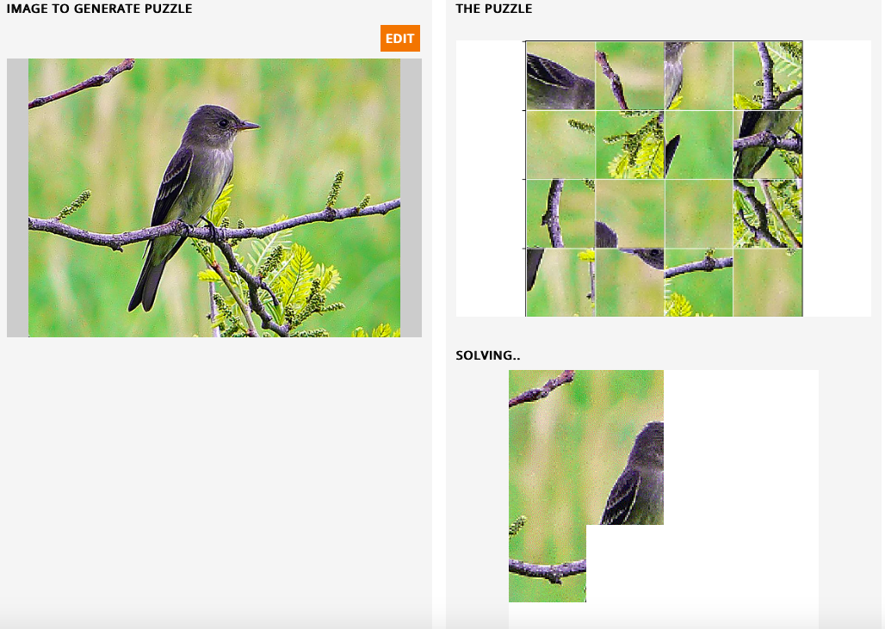

# UnPuzzled
_A Jigsaw puzzle solver using AI_

## An overview

This project consists of two components :  _creation and solving of puzzles_ and _checking adjacency of puzzle pieces_.

I construct a _puzzle generator_, which takes a given image and cuts it up into a rectangular grid of  uniform square puzzle pieces with each puzzle piece being of a specified dimension. It further randomly rotates each square piece by 0/90/180/270 degrees counterclockwise and shuffles up the pieces, thus creating a puzzle. 

I construct several models (machine-learning based and non-machine learning based) which are trained to detect if two given puzzle pieces are adjacent or not. I create custom datasets for these models using a _puzzle-pieces-pair generator_ which is similar to the _puzzle generator_ mentioned above. The actual images to construct the custom datasets are taken from the [CUB-200 dataset](http://www.vision.caltech.edu/visipedia-data/CUB-200-2011). From the start, I split the images in the CUB-200 dataset into training, validation and test portions. I construct custom validation and test datasets to validate and evaluate the checking-adjacency models.

I design a _search algorithm_ which takes a puzzle board with the _top-left corner filled in_, searches for the _best_ pieces to fit into the board till the board is filled completely. The task of determining which pieces fit _better_ makes use of the _checking-adjacency models_. I create _solvers_, which integrate the models with the search algorithm. Finally, I evaluate and compare the performances of the solvers on a test-data set of puzzles which are constructed by the puzzle generator from the test-portion of the CUB-200 dataset split.

__I also give the code for a web-application built using [Gradio](https://github.com/gradio-app/gradio) which simulates the puzzle-solving by the solver which can be deployed on Heroku__

---

_The following notebooks contain code and more precise notes for each step of this project. If the jupyter notebooks take too long to load, please open the markdown versions, which load faster._

## Contents

### Checking adjacency: A subproblem

   1. Problem definition, data generation and visualization
      - [x] [Notebook](CheckingAdjacency/DatasetGeneration/Checking_adjacency_dataset.ipynb), [Markdown](CheckingAdjacency/DatasetGeneration/Checking_adjacency_dataset.md)
     
   2. Adjacency distance: A no ML approach
      - [x] [Notebook](CheckingAdjacency/AdjacencyDistance/Adjacency_distance.ipynb), [Markdown](CheckingAdjacency/AdjacencyDistance/Adjacency_distance.md)
     
   3. Model architectures
      - FromScratch : A CNN model
        - [x] [Notebook](CheckingAdjacency/ModelArchitectures/FromScratch_CNN.ipynb), [Markdown](CheckingAdjacency/ModelArchitectures/FromScratch_CNN.md) 
       
      - ResNetFT : Finetuning the ResNet18 model 
        - [x] [Notebook](CheckingAdjacency/ModelArchitectures/ResNetFT_Finetuning.ipynb), [Markdown](CheckingAdjacency/ModelArchitectures/ResNetFT_Finetuning.md)
       
   4. Training
      -  Training template 
         - [x] [Notebook](CheckingAdjacency/Training/Training_template.ipynb), [Markdown](CheckingAdjacency/Training/Training_template.md)
         
      -  Training FromScratch
         - [x] [Notebook](CheckingAdjacency/Training/Training_FromScratch.ipynb), [Markdown](CheckingAdjacency/Training/Training_FromScratch.md)
         
      -  Training ResNetFT
         - [x] [Notebook](CheckingAdjacency/Training/Training_ResNetFT.ipynb), [Markdown](CheckingAdjacency/Training/Training_ResNetFT.md)
      
       
   5. Evaluation and comparisons of models
      - [x] [Notebook](CheckingAdjacency/EvaluationsAndComparisons/ModelComparisons.ipynb), [Markdown](CheckingAdjacency/EvaluationsAndComparisons/ModelComparisons.md)

---

### Puzzle solver: A search

1. Puzzle generator
   - [x] [Notebook](PuzzleSolver/PuzzleGenerator/Puzzle_generator.ipynb), [Markdown](PuzzleSolver/PuzzleGenerator/Puzzle_generator.md)

2. Search template
   - [x] [Notebook](PuzzleSolver/SearchTemplate/Search_template.ipynb), [Markdown](PuzzleSolver/SearchTemplate/Search_template.md)

3. Solvers
   - In action
     - [x] [Notebook](PuzzleSolver/SolversInAction/Solvers_in_action.ipynb), [Markdown](PuzzleSolver/SolversInAction/Solvers_in_action.md)
     
   - A step by step display 
     - [x] [Notebook](PuzzleSolver/SolversInAction/Solvers_in_action_step_by_step.ipynb), [Markdown](PuzzleSolver/SolversInAction/Solvers_in_action_step_by_step.md)

4. Evaluation and comparisons of solvers
   - [x] [Notebook](PuzzleSolver/SolverEvaluationAndComparisons/SolverComparisons.ipynb), [Markdown](PuzzleSolver/SolverEvaluationAndComparisons/SolverComparisons.md)
   
5. Analysis of incorrectly solved puzzles
   - [x] [Notebook](PuzzleSolver/SolverEvaluationAndComparisons/Incorrectly_solved_puzzles_analysis.ipynb), [Markdown](PuzzleSolver/SolverEvaluationAndComparisons/Incorrectly_solved_puzzles_analysis.md)

---

### Unpuzzler: An application 

1. Web application code
   - [x] [Notebook](WebApp/Unpuzzler_a_web_app.ipynb), [Markdown](WebApp/Unpuzzler_a_web_app.md)

   

 
 
 

